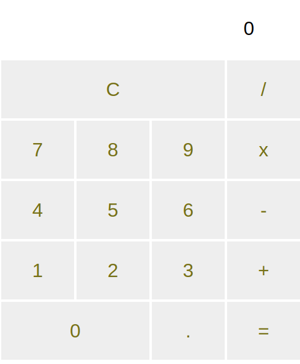
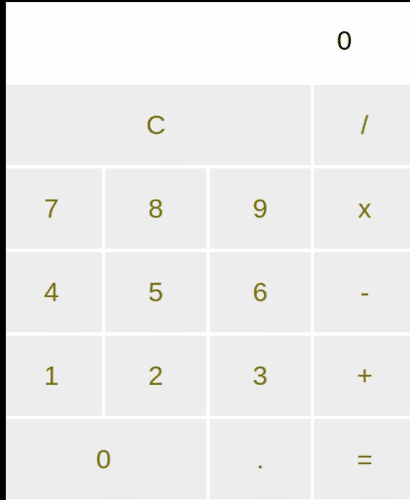
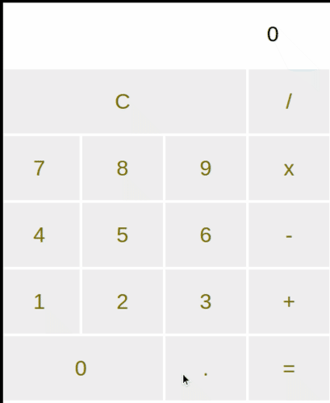
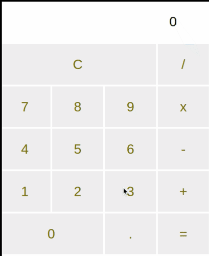

# The Demo Calculator Web Application

This is a demo web application done during the course of the udemy course [Full Stack JavaScript](https://www.udemy.com/course/full-stack-javascript)

- Use in 500px x 701 px for optimal view

## Screenshots

### Startup

### Addition

### Division

### Subtraction

- Also decimals

### Multiplication

## aaaannnndd Reset...

